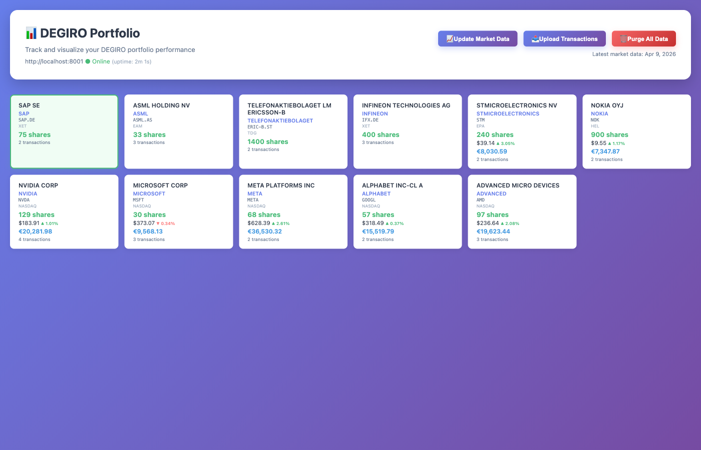

# DEGIRO Portfolio

A web application for tracking and visualizing your DEGIRO portfolio with interactive charts and performance analytics.

## Features

- Import DEGIRO transaction exports from Excel spreadsheets
- Upload new transaction files directly via web interface
- Automatic fetching of historical stock prices using Yahoo Finance
- One-click market data updates for all holdings
- Interactive candlestick charts with transaction markers
- Investment tranche tracking showing individual purchase performance
- Position value percentage charts (where 100% = break even)
- Market index comparison (S&P 500, Euro Stoxx 50)
- Multi-currency support (EUR, USD, SEK)
- Real-time portfolio overview with current holdings and valuations
- SQLite database for efficient data storage and retrieval

## Screenshots

### Portfolio Overview

*Interactive portfolio dashboard showing holdings summary, stock price charts, position value percentage, investment tranche tracking, and market index comparison*

### Stock Detail View

*Detailed view showing Microsoft's performance with multiple chart types including price history, position value %, investment tranches, and performance vs market indices*

## Technology Stack

- **Backend**: FastAPI (Python)
- **Database**: SQLite
- **Data Processing**: Pandas, SQLAlchemy
- **Stock Data**: yfinance
- **Frontend**: Vanilla JavaScript with Plotly.js for charts
- **Package Management**: uv

## Quick Start

```bash
# Install dependencies
uv sync

# Setup database and import data (one-time setup)
uv run invoke setup

# Start the server
./degiro-portfolio start

# Open browser to http://localhost:8000
```

## CLI Commands

The `degiro-portfolio` CLI provides easy server management:

```bash
./degiro-portfolio start    # Start the server
./degiro-portfolio stop     # Stop the server
./degiro-portfolio restart  # Restart the server
./degiro-portfolio status   # Check server status
```

## Invoke Tasks

Additional tasks are available via `invoke`:

```bash
uv run invoke start          # Start the server
uv run invoke stop           # Stop the server
uv run invoke restart        # Restart the server
uv run invoke status         # Check server status
uv run invoke setup          # Import data and fetch prices
uv run invoke import-data    # Import transactions from Excel
uv run invoke fetch-prices   # Fetch latest stock prices
uv run invoke db-info        # Show database information
uv run invoke logs           # Show server logs
uv run invoke dev            # Start development server with auto-reload
uv run invoke clean          # Clean generated files
uv run invoke --list         # Show all available tasks
```

## Project Structure

```
degiro-portfolio/
├── src/degiro_portfolio/
│   ├── __init__.py
│   ├── database.py          # SQLAlchemy models and database config
│   ├── import_data.py       # Import transactions from Excel
│   ├── fetch_prices.py      # Fetch historical stock prices
│   ├── fetch_indices.py     # Fetch market index data
│   ├── main.py              # FastAPI application
│   └── static/
│       └── index.html       # Frontend interface
├── degiro-portfolio         # CLI script for server management
├── tasks.py                 # Invoke tasks for automation
├── Transactions.xlsx        # Your transaction data file
├── example_data.xlsx        # Example demo data (AI stocks)
├── stockchart.db            # SQLite database (generated)
└── pyproject.toml           # Project dependencies
```

## Example Data

The repository includes `example_data.xlsx` with sample AI stock transactions for demonstration purposes. To try the application with this demo data:

```bash
# Import the example data
uv run python -c "from src.degiro_portfolio.import_data import import_transactions; import_transactions('example_data.xlsx')"

# Fetch prices for the stocks
uv run python src/degiro_portfolio/fetch_prices.py

# Fetch market indices
uv run python src/degiro_portfolio/fetch_indices.py

# Start the server
./degiro-portfolio start
```

The example portfolio includes:
- NVIDIA (NVDA) - 129 shares across 4 purchases
- Microsoft (MSFT) - 30 shares across 3 purchases
- Meta (META) - 68 shares across 2 purchases
- Alphabet/Google (GOOGL) - 57 shares across 2 purchases
- AMD - 97 shares across 3 purchases

## Detailed Setup

1. **Install dependencies**:
   ```bash
   uv sync
   ```

2. **Import transaction data**:
   ```bash
   uv run invoke import-data
   # or: uv run python src/stockchart/import_data.py
   ```

3. **Fetch historical stock prices**:
   ```bash
   uv run invoke fetch-prices
   # or: uv run python src/stockchart/fetch_prices.py
   ```

4. **Start the web server**:
   ```bash
   ./degiro-portfolio start
   # or: uv run invoke start
   ```

5. **Open your browser**:
   Navigate to http://localhost:8000

## Usage

### Viewing Your Portfolio

Once the application is running, the main page displays:
- A grid of cards showing all current holdings with share counts
- Click on any stock card to view its detailed price chart
- Charts show candlestick price data with buy/sell transaction markers
- Statistics panel shows key metrics for the selected stock

### Updating Data

To update with new transactions:
```bash
# Re-import the updated Excel file
uv run python src/stockchart/import_data.py

# Fetch latest prices
uv run python src/stockchart/fetch_prices.py
```

## API Endpoints

- `GET /` - Main web interface
- `GET /api/holdings` - List all current stock holdings
- `GET /api/stock/{stock_id}/prices` - Historical prices for a stock
- `GET /api/stock/{stock_id}/transactions` - Transaction history for a stock
- `GET /api/stock/{stock_id}/chart-data` - Combined data for chart visualization (includes position percentage)
- `GET /api/portfolio-performance` - Portfolio-wide performance metrics
- `POST /api/upload-transactions` - Upload new transaction Excel file
- `POST /api/update-market-data` - Fetch latest market data for all stocks and indices

## Database Schema

### Stocks Table
- Stock metadata (symbol, name, ISIN, exchange)

### Transactions Table
- Transaction history (date, quantity, price, fees, transaction type, currency)
- Links to stocks via foreign key

### Stock Prices Table
- Historical OHLCV (Open, High, Low, Close, Volume) data
- Links to stocks via foreign key

### Indices Table
- Market index metadata (symbol, name)

### Index Prices Table
- Historical closing prices for market indices
- Links to indices via foreign key

## Notes

- The application uses Yahoo Finance ticker symbols mapped from ISIN codes
- Historical data starts from the earliest transaction date for each stock
- Charts are interactive and support zooming, panning, and hovering for details
- Transaction markers are sized based on the quantity traded
