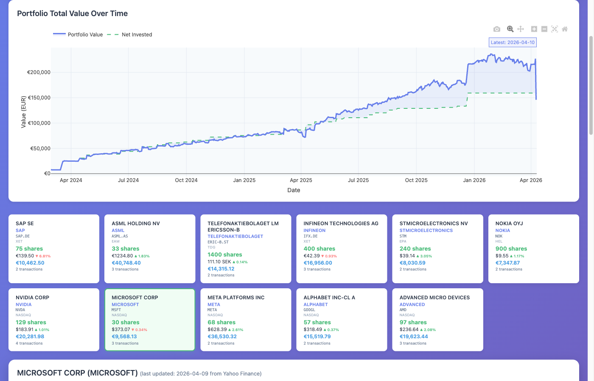

# Features

This page explains everything the application can do for you.

## Key Feature Highlights

### 📊 Real-Time Portfolio Tracking
- View all your holdings in one place with live prices
- See your total portfolio value and gain/loss at a glance
- Track performance over time with interactive charts

### 💰 Multi-Currency Support
- Automatic EUR conversion for USD, SEK, GBP stocks
- All position values displayed in EUR for easy comparison
- Price charts show original currency for accuracy

### 📈 Interactive Charts
- Candlestick price charts with transaction markers
- Position value percentage tracking (above 100% = profit)
- Individual investment tranche performance
- Market comparison against S&P 500 and Euro Stoxx 50

### ⚡ Easy Data Management
- One-click market data updates
- Drag-and-drop transaction file uploads
- Automatic price fetching for all stocks

### 🔒 Privacy First
- All data stored locally on your computer
- No cloud services or external servers (except for price downloads)
- Full control over your financial data

## Visual Overview


*Main dashboard showing portfolio summary, action buttons, and stock holdings*

### Main Action Buttons

The dashboard provides three main action buttons:

1. **📈 Update Market Data**
   - Refreshes all stock prices from Yahoo Finance
   - Updates market indices (S&P 500, Euro Stoxx 50)
   - Fetches latest exchange rates for currency conversion
   - Takes about 30-60 seconds depending on number of stocks

2. **📤 Upload Transactions**
   - Import new DEGIRO transaction files (Excel format)
   - Automatically adds new stocks to your portfolio
   - Fetches historical prices for new stocks
   - Supports incremental updates (add new transactions to existing data)

3. **🗑️ Purge All Data**
   - Clears all data to start fresh
   - Shows confirmation dialog before deleting
   - Use this if you want to import different data or start over
   - **Warning**: This is permanent and cannot be undone!

## Managing Your Portfolio

### Importing Your Transactions

**What it does**: Takes your DEGIRO transaction history and imports it into the application.

✅ **Drag and Drop Upload** - Click the upload button, select your Excel file from DEGIRO, done!
✅ **Automatic Stock Detection** - The app automatically recognizes all your stocks
✅ **Multi-Currency Support** - Works with EUR, USD, SEK, GBP and automatically converts to EUR
✅ **Smart Processing** - Links all your buy/sell transactions together for each stock

**How to use**: Click "📤 Upload Transactions" in the web interface, select your DEGIRO Excel export.

### Getting Price Data

**What it does**: Downloads historical stock prices so you can see charts and track performance.

✅ **Automatic Download** - Prices download automatically when you upload transactions
✅ **One-Click Updates** - Click "📈 Update Market Data" to refresh all prices
✅ **Market Benchmarks** - Also downloads S&P 500 and Euro Stoxx 50 for comparison
✅ **Fast Access** - All data stored on your computer for instant viewing

**How to use**: Prices update automatically on upload. Click "Update Market Data" anytime to refresh.

## Portfolio Overview

The main dashboard provides:

### Stock Cards

Each stock displays:
- Company name and ticker symbol
- Current share count
- Latest closing price
- Daily percentage change (▲ increase / ▼ decrease)
- Exchange information
- Transaction count

### Market Data Status

- Shows the most recent price update date
- Helps you know when data was last refreshed

### Interactive Elements

- **Clickable Tickers**: Links to Google Finance for quick reference
- **Company Names**: Links to Google search for investor relations
- **Compact Design**: Space-efficient layout showing all key information

## Portfolio Summary at a Glance

The **Portfolio Summary** section displays your key metrics in an easy-to-read format:

| Metric | What It Shows |
|--------|---------------|
| **Total Holdings** | Number of different stocks you own (e.g., "6 stocks") |
| **Net Invested** | Total amount you've invested in EUR (e.g., "€105,061.37") |
| **Current Value** | Current total value of your portfolio in EUR (e.g., "€172,102.88") |
| **Total Gain/Loss** | Your profit or loss with percentage in green (profit) or red (loss) (e.g., "+€67,041.51 +63.81%") |

### Portfolio Value Over Time Chart

Below the summary, you'll see a **Portfolio Total Value Over Time** chart showing:

- **Blue solid line**: Your portfolio's current value over time
- **Green dashed line**: How much you've invested (net invested)
- **Gap between lines**: Your profit (when blue is above green) or loss (when blue is below green)
- **Latest annotation**: Shows the most recent date with exact value

This chart gives you a complete picture of your investment journey, showing both how much you've put in and how your investments have performed.

## Stock Cards

Each stock is displayed in a card showing:

- **Company Name** (clickable - opens Google search for investor relations)
- **Ticker Symbol** (clickable - opens Google Finance)
- **Exchange** (where the stock trades)
- **Number of Shares** you own
- **Current Price** with daily change indicator (▲ green for up, ▼ red for down)
- **Position Value** in EUR (automatically converted from stock's currency)
- **Transaction Count** (how many times you've bought/sold)

Click any stock card to see detailed charts for that stock.

## Understanding the Charts


*Detailed stock view showing multiple chart types and investment performance*

When you click on any stock card, you'll see four interactive charts:

### 1. Price Chart (Candlestick Chart)

**What it shows**: Historical stock price movements with your buy/sell transactions marked.

**How to read candlesticks**:
- Each bar represents one day
- **Green bars** = Price went up that day (closing price > opening price)
- **Red bars** = Price went down that day (closing price < opening price)
- **Tall bars** = High volatility (large price swings)
- **Short bars** = Low volatility (stable price)

**Transaction markers**:
- **Green triangles** (▲) = Your buy transactions
- **Red triangles** (▼) = Your sell transactions
- Hover over markers to see exact date, quantity, and price

**Interactive features**:
- **Zoom**: Mouse wheel or pinch gesture
- **Pan**: Click and drag left/right
- **Hover**: See exact OHLC (Open, High, Low, Close) prices for any day
- **Reset**: Click the home icon to reset zoom

**Why it's useful**: Understand the stock's historical performance and see how your purchase timing affected your returns. Did you buy at a good price? The markers show exactly when you entered positions.

### 2. Position Value % Chart

**What it shows**: Your profit or loss as a percentage of your investment over time.

**How to read the percentage**:
- **Line at 100%** (horizontal dashed line) = Break-even point (no profit, no loss)
- **Line above 100%** = Profit! You're making money
  - 110% = 10% profit
  - 120% = 20% profit
  - 150% = 50% profit
- **Line below 100%** = Loss. Your position is worth less than you paid
  - 90% = 10% loss
  - 80% = 20% loss
  - 50% = 50% loss

**Real example from your portfolio**:
If you invested €10,000 and the chart shows 125%, your position is now worth €12,500 (25% gain, or +€2,500).

**Why this is different from price change**:
- This tracks YOUR position value, not just the stock price
- Takes into account ALL your purchases at different prices
- Shows how much money YOU have made/lost total
- More meaningful than just looking at current price

**Why it's useful**: This is the chart that answers "Am I actually making money on this investment?" It's the most important chart for tracking your personal returns.

### 3. Investment Tranches Chart

**What it shows**: Performance of each individual purchase (tranche) separately.

**What is a tranche?**
A "tranche" is simply one purchase transaction. If you bought the same stock on three different dates, you have three tranches.

**Example scenario**:
Let's say you bought NVIDIA stock three times:
- **Tranche 1**: April 1, 2024 - 10 shares @ $120 = $1,200 invested
- **Tranche 2**: June 1, 2024 - 5 shares @ $150 = $750 invested
- **Tranche 3**: August 1, 2024 - 15 shares @ $100 = $1,500 invested

The tranche chart shows how each of these purchases is performing individually.

**Why this matters**:
- See which purchases were good timing and which weren't
- Understand your cost basis (average purchase price)
- Identify if dollar-cost averaging (buying at different times) is working for you
- Useful for tax planning (which shares to sell first)

**How to read the chart**:
- Each colored line represents one purchase
- Lines going up = that purchase is profitable
- Lines going down = that purchase is at a loss
- Hover over any line to see exact purchase details and current value

**Below the chart**: You'll see tranche cards showing:
- Purchase date and price
- Number of shares
- Current value
- Profit/loss in both amount and percentage

**Why it's useful**: Helps you understand if your buying strategy is working. Maybe you consistently buy at highs or lows - this chart reveals your patterns.

### 4. Market Comparison Chart

**What it shows**: How your stock performs compared to major market indices (benchmarks).

**The three lines you see**:
1. **Your Stock** - The individual stock's performance
2. **S&P 500** (^GSPC) - Represents the overall US stock market (500 largest US companies)
3. **Euro Stoxx 50** (^STOXX50E) - Represents the European market (50 largest EU companies)

**How to interpret the comparison**:

**All lines start at 0%** (normalized from your first purchase date)
- Lines going up = positive returns
- Lines going down = negative returns

**Your stock line ABOVE the indices** = Outperforming 🎉
- You picked a winner! Your stock is doing better than the overall market
- Example: Your stock is at +40%, S&P 500 is at +20% = You're beating the market by 20%

**Your stock line BELOW the indices** = Underperforming 📉
- The market is doing better than your stock
- Example: Your stock is at +10%, S&P 500 is at +25% = You're lagging the market by 15%
- Consider: Would you have been better off in an index fund?

**Why this matters**:
- A stock being "up" doesn't mean it's good - it needs to beat the market
- If your stock is up 5% but the market is up 20%, you actually underperformed
- Helps you evaluate if your stock picking strategy is working
- Shows if you should just invest in index funds instead

**Example interpretation**:
"My tech stock is up 50% (great!), but the S&P 500 is up 60% (better). I underperformed by 10%. Maybe I should reconsider my stock selection strategy."

**Why it's useful**: Provides context for your returns. Making money isn't enough - you want to beat what you could have made in a simple index fund.

## Tips for Using the Charts Effectively

### Mastering the Interactive Controls

**Chart Toolbar** (icons in top-right corner of each chart):
- 📷 **Camera** - Download chart as image (PNG)
- 🔍+ **Zoom In** - Magnify specific area
- 🔍- **Zoom Out** - See more data
- 🔲 **Box Select** - Drag to select and zoom to specific date range
- 🏠 **Home** - Reset to default view
- ↔️ **Pan** - Move left/right across time
- 🔄 **Autoscale** - Fit all data in view

**Keyboard/Mouse Shortcuts**:
- **Mouse Wheel** - Zoom in/out on charts
- **Click & Drag** - Pan across timeline
- **Double Click** - Reset zoom
- **Hover** - See exact values at any point

### Answering Key Investment Questions

The charts are designed to answer specific questions about your investments:

| Question | Chart to Use | What to Look For |
|----------|--------------|------------------|
| "Am I making money overall?" | Position Value % | Line above 100% = profit |
| "Did I buy at a good time?" | Price Chart | Green markers near price lows |
| "Which purchases were best?" | Investment Tranches | Highest percentage gains |
| "Am I beating the market?" | Market Comparison | Your line above S&P 500 |
| "How's my portfolio growing?" | Portfolio Value Over Time | Blue line trending up |
| "What's my best stock?" | Compare Position % across stocks | Highest % above 100% |

### Pro Tips for Analysis

**1. Check Multiple Time Frames**
- Zoom into recent months to see short-term performance
- Zoom out to years to see long-term trends
- Different timeframes tell different stories

**2. Compare Before Major Events**
- Look at performance during market crashes
- See how your stocks held up vs the market
- Learn if your portfolio is defensive or aggressive

**3. Use Tranche Data for Strategy**
- If early purchases always outperform, maybe buy less frequently
- If dollar-cost averaging (multiple purchases) works, keep doing it
- Identify if you have a pattern of buying high or low

**4. Track vs Benchmarks Regularly**
- Check monthly if you're beating S&P 500
- If consistently underperforming, consider index funds
- Outperforming 60% of the time is considered good

**5. Screenshot for Records**
- Use the camera icon to save chart images
- Keep records of your performance over time
- Compare year-over-year progress

## Managing Your Data

### Clearing All Data

**What it does**: Removes all your transactions and price data if you want to start fresh.

**How to use**:
1. Scroll to the bottom of the dashboard
2. Click the red "⚠️ Delete All Data" button
3. Confirm the deletion

**Warning**: This permanently deletes everything! You'll need to re-upload your transactions.

**When to use it**:
- You want to start over from scratch
- You uploaded the wrong file and want to clean up
- You're testing the application with demo data

### Viewing Information

**Command-line tools** (optional, for advanced users):

```bash
# See how many stocks and transactions you have
uv run invoke db-info

# View what the server is doing (useful for troubleshooting)
uv run invoke logs
```

## Multi-Currency Support

**What it does**: The app works with stocks in different currencies and converts everything to EUR for easy comparison.

**Supported currencies**:
- 🇪🇺 EUR (Euro)
- 🇺🇸 USD (US Dollar)
- 🇸🇪 SEK (Swedish Krona)
- 🇬🇧 GBP (British Pound)

**How it works**:
- Stock prices display in their original currency
- Position values automatically convert to EUR
- Exchange rates update daily
- Charts show prices in the currency you bought/sold in

**Example**: If you own US stocks (priced in USD) and European stocks (priced in EUR), the app shows your total portfolio value in EUR so you can easily compare them.

## What You Can Track

The application shows you:

### Portfolio Level
✅ **Total Portfolio Value** - Sum of all your investments in EUR
✅ **Overall Gain/Loss** - How much money you've made or lost overall
✅ **Number of Holdings** - How many different stocks you own

### Individual Stock Level
✅ **Current Value** - What your shares are worth now
✅ **Purchase Price** - What you originally paid
✅ **Profit/Loss** - Difference between current value and what you paid
✅ **Percentage Return** - Your profit/loss as a percentage
✅ **Daily Change** - How much the stock moved today
✅ **Share Count** - Number of shares you own

### Performance Tracking
✅ **Historical Performance** - How your stocks have performed over time
✅ **Market Comparison** - How you're doing vs S&P 500 and Euro Stoxx 50
✅ **Transaction History** - All your buy/sell transactions with dates and prices
✅ **Tranche Performance** - Performance of each individual purchase

## Additional Features

### Quick Links
- Click any **company name** to search Google for investor relations info
- Click any **ticker symbol** to view the stock on Google Finance
- Click "Update Market Data" to refresh all prices instantly

### Data Privacy
- All data stored locally on your computer
- No account required
- No data sent to external servers (except to download stock prices)

