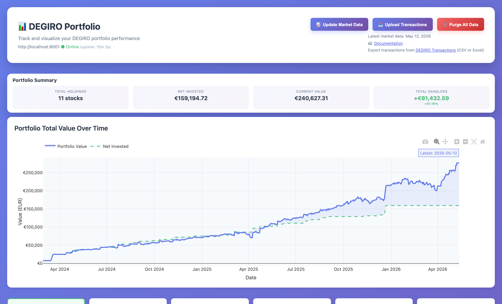
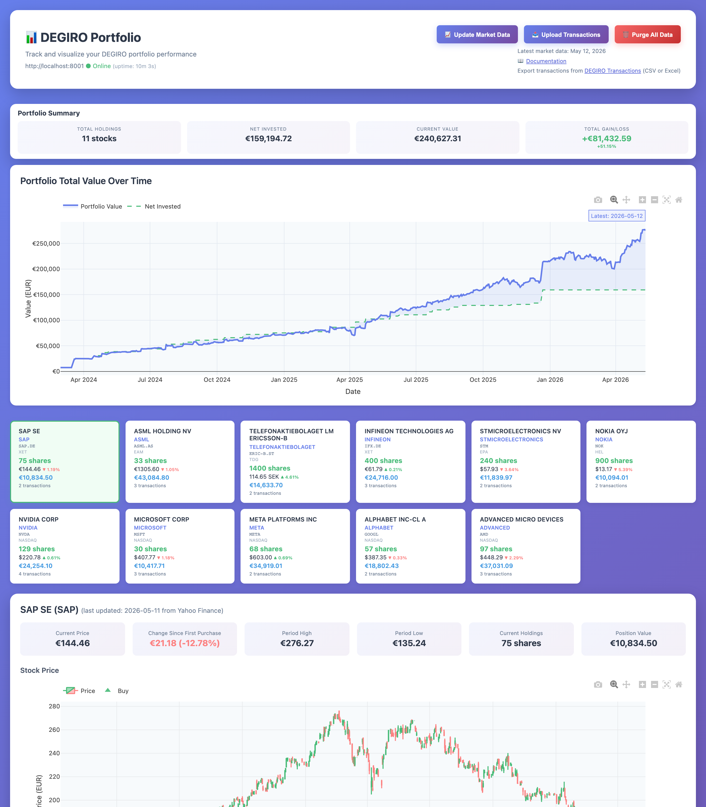

# Getting Started

This guide will help you install and use DEGIRO Portfolio Tracker in just a few minutes.

## Installation

### Step 1: Install Python

You need Python 3.11 or newer. [Download Python here](https://www.python.org/downloads/) if you don't have it.

To check if you have Python installed, open Terminal (Mac/Linux) or Command Prompt (Windows) and type:
```bash
python --version
```

### Step 2: Install the Application

Open Terminal (Mac/Linux) or Command Prompt (Windows) and run:

```bash
pip install degiro_portfolio
```

This installs the application including desktop mode support.

**Note for Developers**: If you want to install from source code, see the [Developer Appendix](developer-appendix.md).

## Quick Start

### 1. Launch the Desktop App

```bash
python -m degiro_portfolio --desktop
```

The application opens in a native window — no browser needed. The server starts and stops automatically with the window.

On Mac, the window uses WebKit; on Windows, it uses WebView2. Everything runs locally on your computer.

To use a different port (e.g., if 8000 is busy):
```bash
python -m degiro_portfolio --desktop --port 8001
```

### 2. Open the Dashboard

If running in web mode, open your web browser (Chrome, Firefox, Safari, etc.) and go to:

```
http://localhost:8000
```

You should now see the portfolio dashboard!


*The main portfolio dashboard showing your holdings, performance charts, and action buttons*

**What's localhost?** It's a special address that means "this computer". The dashboard only runs on your computer and can't be accessed from anywhere else.

### 3. Upload Your First Transaction File


*The main dashboard with the Upload Transactions button in the top-right*

#### Step 1: Export from DEGIRO

1. Log in to your DEGIRO account
2. Go to **Portfolio** → **Transactions**
3. Set your date range (e.g., "All time" or specific period)
4. Click **Export** and select **Excel** format
5. Save the file (typically named `Transactions.xlsx`)

#### Step 2: Upload to the Application

1. Click the **📤 Upload Transactions** button in the top-right corner of the application
2. Select your DEGIRO `Transactions.xlsx` file
3. Click **Upload**

The application will automatically:
- Import all transactions
- Fetch historical price data for your stocks
- Update live market prices
- Fetch market index data (S&P 500, Euro Stoxx 50) for comparison

**That's it!** Your portfolio is now ready to view with:
- Interactive price charts
- Transaction history
- Performance metrics
- Market index comparisons

### 4. Refresh Stock Prices (Optional)

Stock prices are automatically downloaded when you upload transactions. To get the latest prices at any time:

1. Click the **📈 Update Market Data** button at the top of the page
2. Wait a moment while prices update (you'll see a loading indicator)
3. The charts and stock cards will refresh with the latest data

**How often should I update?** Stock markets only change during trading hours (weekdays), so updating once per day is usually sufficient.

## What You'll See First

When you first open the application (before uploading any data), you'll see an empty dashboard with the three action buttons at the top. This is normal!

To get started, click the **"📤 Upload Transactions"** button and select your DEGIRO Excel export file.

After uploading, the application will:
1. Import all your transactions (takes a few seconds)
2. Download historical prices for all your stocks (takes 1-2 minutes)
3. Fetch market index data for comparison (S&P 500, Euro Stoxx 50)
4. Display your complete portfolio with charts

**Be patient on first upload!** The first import takes longer because it downloads all historical price data. Subsequent uploads are much faster.

## Understanding Your Dashboard

After uploading transactions, you'll see:


*Complete portfolio view showing summary, stock cards, and detailed charts*

### Portfolio Summary
Shows your total portfolio value and overall gain/loss percentage.

### Stock Cards
Each card shows:
- Company name (click to search for investor info)
- Number of shares you own
- Current price with today's change (▲ up / ▼ down)
- Total value of your position in EUR
- Ticker symbol (click to view on Google Finance)
- Exchange where it trades

### Charts
Click any stock card to see:
1. **Price Chart** - Historical prices with your buy/sell transactions marked
2. **Position Value %** - Shows if you're profitable (above 100% = profit)
3. **Investment Tranches** - Performance of each individual purchase
4. **Market Comparison** - How your stock compares to S&P 500 and Euro Stoxx 50

## What File Format Is Supported?

The application works with DEGIRO's standard Excel export format. Your export should include these columns:
- Date - Transaction date
- Time - Transaction time
- Product - Stock name
- ISIN - International stock identifier
- Exchange - Which stock exchange
- Quantity - Number of shares
- Price - Price per share
- Local value - Transaction value in stock's currency
- Value (EUR) - Transaction value in EUR
- Exchange rate - Currency conversion rate
- Transaction and/or third - Transaction type and fees

**Don't worry about the format** - if you export from DEGIRO correctly, the format will be correct automatically.

## Stock Prices

The application uses **Yahoo Finance** for stock prices — it's free and requires no configuration. See [Data Providers](data-providers.md) for more details.

## Alternative: Web Server Mode

If you prefer to use a browser instead of the desktop app, run without `--desktop`:

```bash
python -m degiro_portfolio
```

Then open `http://localhost:8000` in your browser.

**Mac/Linux** also supports the CLI for background server management:
```bash
degiro_portfolio start     # Start the server
degiro_portfolio stop      # Stop the server
degiro_portfolio restart   # Restart the server
degiro_portfolio status    # Check if server is running
```

**Windows**: Use `python -m degiro_portfolio` for all commands.

## Next Steps

- **[Features](features.md)** - Explore all available features
- **[Data Providers](data-providers.md)** - Learn about price data sources
- **[Advanced Setup](advanced-setup.md)** - Advanced configuration options

## Troubleshooting

### The application won't start

**Problem**: Running `degiro_portfolio start` gives an error.

**Solutions**:
- Make sure Python 3.11+ is installed: Run `python --version` to check
- Try: `python -m degiro_portfolio start` instead
- Check if port 8000 is already in use by another program
- Restart your computer and try again

### Can't open the dashboard in my browser

**Problem**: Browser shows "This site can't be reached" or "Connection refused".

**Solutions**:
- Make sure the server is running: Run `degiro_portfolio status`
- Try the URL exactly: `http://localhost:8000` (not https://)
- Try `http://127.0.0.1:8000` instead
- Check if your firewall is blocking port 8000

### My stocks don't show any prices

**Problem**: Stock cards show no prices or values.

**Solutions**:
- Wait a few moments - prices download in the background after upload
- Click the "📈 Update Market Data" button
- Check your internet connection
- Some stocks might not be available on Yahoo Finance (rare for major stocks)
- Check the browser console for error messages (press F12)

### A specific stock can't be found

**Problem**: One or more stocks show "Price data unavailable".

**Solutions**:
- Check the stock's ISIN in your DEGIRO export is correct
- Try updating market data again
- The stock might be delisted or only available on regional exchanges
- Consider configuring a different data provider (see Advanced section)

### Upload button doesn't work

**Problem**: Clicking upload does nothing or shows an error.

**Solutions**:
- Make sure you're uploading an Excel file (.xlsx)
- Verify it's a DEGIRO transaction export (not portfolio or another report)
- Check the file isn't corrupted - try opening it in Excel first
- Look at the browser console (F12) for error messages
- Make sure the file has the expected columns (Date, Product, ISIN, etc.)

### The page loads but looks broken

**Problem**: Layout is weird, buttons missing, or page doesn't display correctly.

**Solutions**:
- Refresh the page (Ctrl+R or Cmd+R)
- Clear your browser cache
- Try a different browser (Chrome, Firefox, Safari)
- Make sure JavaScript is enabled in your browser

### Charts don't appear

**Problem**: Stock cards show but clicking them doesn't show charts.

**Solutions**:
- Check browser console for JavaScript errors (press F12)
- Make sure you have price data (see "stocks don't show prices" above)
- Try refreshing the page
- Disable browser extensions that might block content

### Server keeps stopping or crashing

**Problem**: Server stops running after a while.

**Solutions**:
- Check the logs: `degiro_portfolio logs` (or check server.log file)
- Make sure you have enough disk space
- Check if your computer goes to sleep - keep it awake
- Run in a terminal that stays open (don't close the terminal window)

### Need More Help?

If you're still stuck:
1. Check the logs for error messages: `degiro_portfolio logs`
2. Visit the [GitHub Issues](https://github.com/jdrumgoole/degiro_portfolio/issues) page to report the problem
3. Include these details when asking for help:
   - What you were trying to do
   - What happened instead
   - Any error messages you saw (from the logs or browser console)
   - Your operating system (Windows/Mac/Linux)
   - Python version (`python --version`)
